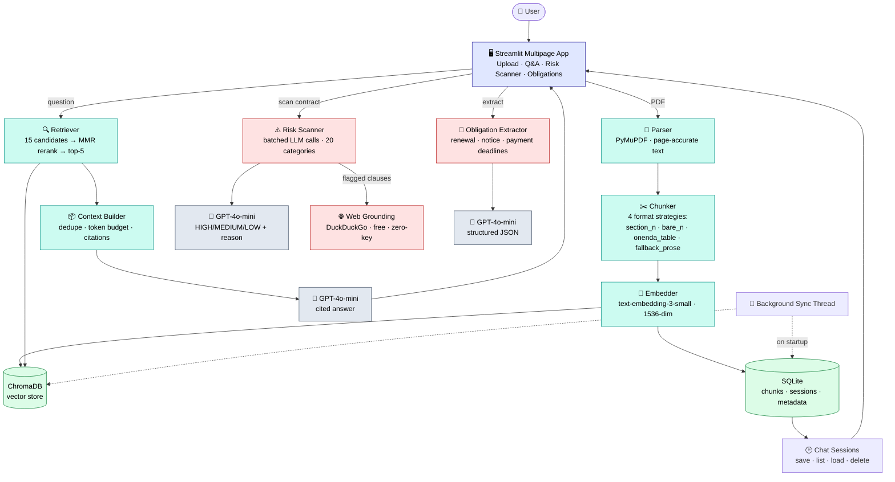

<div align="center">

# ⚖️ ClauseInsight

### Upload a contract. Understand every clause. Know every risk.

*Your AI legal assistant — reads the fine print so you don't have to.*

[](https://github.com/LegendTejas/ClauseInsight/actions/workflows/ci.yml)
[](https://www.python.org/)
[](https://streamlit.io/)
[](https://platform.openai.com/)
[](https://www.trychroma.com/)
[](LICENSE)
[](tests/)

</div>

---

## 🧩 The Problem

People often sign contracts they don't fully understand. A fresh hire signs an employment agreement without noticing that Section 9.3 assigns every personal side-project to the company. A freelancer agrees to an NDA with a five-year non-compete buried on page 14. Nobody re-reads a thirty-page contract to check when the auto-renewal notice period expires.

The issue isn't carelessness — legal language is deliberately dense, contracts are long, and most people don't know what to look for.

**ClauseInsight** solves this by acting as your personal AI legal assistant. It reads the whole contract the moment it's uploaded: it flags risky clauses before you ask, extracts every deadline onto a timeline, backs its risk calls with real web sources, and answers plain-English questions with exact clause + page citations.

---

## ✨ What It Can Do

| | Feature | What it actually does |
|---|---|---|
| ⚡ | **Proactive Risk Scanner** | Classifies *every* clause as `HIGH` / `MEDIUM` / `LOW` risk against a 20-category legal taxonomy — before you've asked a single question. |
| 💬 | **Cited Q&A** | Ask plain-English questions, get answers grounded in the contract with exact clause + page citations. Two-stage retrieval: 15 candidates → MMR rerank (λ=0.7) → top-5. |
| ⚖️ | **Multi-Contract Reasoning** | Select more than one ingested contract and ask *"what's different about the termination clause?"* — retrieval runs across all selected documents at once. |
| 📅 | **Obligations & Deadlines** | Pulls every renewal date, notice period, termination window, and payment deadline into one sortable timeline, so nothing quietly expires. |
| 🌐 | **Web-Grounded Risk Validation** | For every `HIGH` and `MEDIUM` risk clause, searches the live web (DuckDuckGo, zero cost, no API key) for supporting sources — so a risk flag isn't just the model's opinion. |
| 🕒 | **Persistent Chat History** | Every Q&A session is saved to SQLite with an auto-generated title. Close the tab, come back tomorrow, pick up exactly where you left off. |
| 🔄 | **Self-Healing Vector Store** | A background thread reconciles SQLite and ChromaDB on startup — switch embedding models or lose your `data/chroma/` folder, and it quietly re-syncs. |
| 🎨 | **Actually Nice UI** | Dark/light toggle, gradient hero cards, glassmorphism panels — built with a custom `theme.py`, not default Streamlit grey boxes. |

---

## 🖥️ See It In Action


```text
┌────────────────────────────────────────────────────────────────────┐
│ 1. Upload           2. Ask                 3. Get Flagged          │
│ ─────────           ──────                 ─────────────           │
│ Drop in a PDF  →    "What happens"    →    [HIGH RISK]             │
│ Parsed, chunked,    if I terminate         Section 9.3             │
│ embedded in         early?                Unlimited                │
│ seconds             Ref: Section 9.3      Indemnification          │
│                     p.12                 3 sources found online    │
└────────────────────────────────────────────────────────────────────┘
```

---

## 🏗️ Architecture



An architecture diagram can also be found in **[​docs/architecture_clauseinsight.pdf](​docs/architecture_clauseinsight.pdf)**

---

## 🛠️ Tech Stack

| Layer | Choice | Why |
|---|---|---|
| **PDF Parsing** | PyMuPDF (`fitz`) | Fast, reliable, returns exact page numbers for real citations. |
| **Chunking** | Custom Python, 4 strategies | Legal contracts have natural section headers — splitting on them beats arbitrary character counts. |
| **Embeddings** | OpenAI `text-embedding-3-small` | 1536-dim, strong semantic quality on dense legal text. |
| **Vector Store** | ChromaDB | Zero-config, fully local, perfect for a single-machine deployment. |
| **Relational DB** | SQLite (WAL mode) | Thread-safe local storage for chunks, metadata, and chat sessions. |
| **LLM** | OpenAI `gpt-4o-mini` | Reliable structured JSON output at a good speed/cost balance. |
| **Web Search** | DuckDuckGo via `ddgs` | Grounds risk flags in real sources — free, no API key, no signup. |
| **Frontend** | Streamlit + custom `theme.py` | Fast to build, easy to make genuinely good-looking with custom CSS. |

---

## 📁 Project Structure

```text
ClauseInsight/
│
├── src/
│   ├── pipeline/              # Ingestion: parse → chunk → embed
│   │   ├── parser.py              PDF text + page extraction (PyMuPDF)
│   │   ├── chunker.py             Clause-aware chunking, 4 format strategies
│   │   └── embedder.py            Embeddings + idempotent upsert + background sync
│   │
│   ├── retrieval/              # Search + context assembly
│   │   ├── retriever.py           Vector search + MMR reranking
│   │   └── context_builder.py     Dedup, token budget, citation formatting
│   │
│   ├── risk/                   # Risk classification + validation
│   │   ├── scanner.py             Batched LLM clause classification
│   │   ├── risk_labels.py         RiskLevel / ClauseCategory taxonomy
│   │   └── web_grounding.py       Free DuckDuckGo grounding for flagged clauses
│   │
│   ├── obligations/             # Deadline extraction
│   │   ├── extractor.py           Batched LLM obligation/deadline extraction
│   │   └── obligation_labels.py   ObligationType taxonomy + data schema
│   │
│   ├── ui/
│   │   ├── app.py                 Entry point — config, theme, background sync
│   │   ├── theme.py                Dark/light CSS, gradient cards, animations
│   │   └── pages/
│   │       ├── 1_upload.py         Upload + ingest
│   │       ├── 2_qa.py             Cited Q&A + multi-contract + chat history
│   │       ├── 3_scanner.py        Risk dashboard + web grounding
│   │       └── 4_obligations.py    Deadlines timeline
│   │
│   └── utils/
│       ├── store.py                ChromaDB + SQLite connection helpers
│       └── logger.py               Centralised logging
│
├── docs/adr/                   # Architecture Decision Records
│ 
├── data/                           Local storage for databases and metadata
│   ├── chroma/                     Vector database storage (auto-created at runtime, gitignored)
│   └── metadata.db
│ 
├── .streamlit/                      
│   └── config.toml                 Streamlit configuration (themes, server settings)   
│ 
├── tests/                      # 280+ tests, mirrors src/ structure
├── legal_contracts/            # Sample contracts for dev/testing
├── .github/workflows/ci.yml    # Lint + typecheck + test on every push
├── requirements.txt / pyproject.toml
└── README.md
```

---

## 🚀 Quickstart

### Prerequisites
- Python 3.13+
- Git
- An OpenAI API key → [platform.openai.com](https://platform.openai.com/)

### Setup

```bash
# 1. Clone
git clone https://github.com/LegendTejas/ClauseInsight.git
cd ClauseInsight

# 2. Virtual environment
uv venv
source .venv/bin/activate      # Windows: .venv\Scripts\activate

# 3. Install
uv pip install -r requirements.txt

# 4. Configure
echo "OPENAI_API_KEY=your_api_key_here" > .env
```

### Run

```bash
streamlit run src/ui/app.py
```

### Test

```bash
pytest -m "not integration"     # unit tests only, no API calls
pytest                          # everything, including live OpenAI calls
```

---

## 📜 Architecture Decision Records

Key technical trade-offs are documented in [`docs/adr/`](docs/adr/):

- **[ADR-001](docs/adr/ADR-001-chromadb.md)** — Why ChromaDB over other vector stores
- **[ADR-002](docs/adr/ADR-002-clause-chunking.md)** — Clause-aware chunking strategy
- **[ADR-003](docs/adr/ADR-003-llm-choice.md)** — Choice of LLM provider

---

## 🧪 Testing

- **280+ tests** across pipeline, retrieval, risk, and obligations modules
- Unit tests run with mocked LLM/search calls — fast, free, run in CI on every push
- Integration tests (`pytest -m integration`) hit the real OpenAI API and are run manually
- CI enforces lint (ruff + black), type checking (pyright), and a coverage floor via GitHub Actions

---

## 🎯 Mini-Extensions

Beyond the core parse → embed → retrieve → cite pipeline, ClauseInsight ships three standalone extensions:

1. **Multi-Contract Reasoning** — select multiple ingested contracts in the Q&A page and ask cross-document questions; retrieval runs against all of them at once.
2. **Obligations & Deadlines Extractor** — a second LLM pass, independent of the risk scanner, that turns buried dates into a sortable action list.
3. **Web-Grounded Risk Validation** — every flagged clause gets checked against live web sources, so "this looks risky" comes with receipts.

---

## ⚠️ Known Limitations

- **Scanned PDFs**: no OCR yet — a contract with no embedded text layer returns empty text.
- **Non-standard formatting**: contracts without numbered section headers fall back to paragraph-splitting, which can reduce citation precision slightly.
- **Embedding dimension lock-in**: `text-embedding-3-small` produces 1536-dim vectors — don't mix embeddings from a different model into the same ChromaDB collection without clearing `data/chroma/`.
- **DuckDuckGo isn't an official API**: `ddgs` scrapes public search results, so it has no SLA and can occasionally rate-limit under heavy repeated use.
- **Large contracts take longer**: a 100-page contract means a lot of batched LLM calls — scanning is safely rate-limited, so expect it to take longer, not to fail.

---

## 📄 License & Acknowledgements

- **License**: MIT — see [LICENSE](LICENSE)
- **Acknowledgements**: Developed as part of the 2nd Year B.Tech CSE-AIDE Summer Internship (2026).