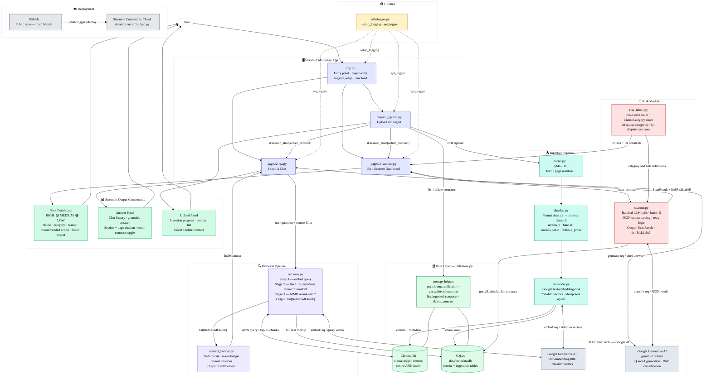

## ClauseInsight — System Architecture

---

### Key Architecture Changes from Earlier Version

| Area | Old Design | Current Design |
|---|---|---|
| **UI structure** | Single `app.py` with 3 tabs | Multipage app: `app.py` + `pages/1_upload.py`, `2_qa.py`, `3_scanner.py` |
| **Compare tab** | Separate `comparator.py` with V1/V2 collections | **Removed** — single shared `clauseinsight_chunks` collection |
| **Embedding model** | OpenAI `text-embedding-3-small` (1536-dim) | Google `text-embedding-004` (768-dim) |
| **LLM** | OpenAI `gpt-4o-mini` | Google `gemini-2.0-flash` |
| **Vector store** | Two collections (`contract_v1`, `contract_v2`) | One collection with `source_name` metadata filter |
| **Data layer** | ChromaDB only via `vectorstore.py` | Dual store: ChromaDB (vectors) + SQLite (full text + metadata) via `utils/store.py` |
| **Retrieval** | Plain similarity search, top-3 | Two-stage MMR pipeline: 15 candidates → rerank → top-5 |
| **Context assembly** | Inline in Q&A engine | Dedicated `retrieval/context_builder.py` → `BuiltContext` |
| **Risk labels** | Inline in `risk_scanner.py` | Separate `risk/risk_labels.py` (enums, definitions, UI constants) |
| **Chunker** | Regex + 500-char fallback | Format detector → 4 strategies (section_n, bare_n, onenda_table, fallback_prose) |
| **Session state** | Per-tab state | Cross-page `active_contract` via `st.session_state` |
| **Logging** | Ad-hoc | Centralised `utils/logger.py` with `setup_logging` / `get_logger` |
